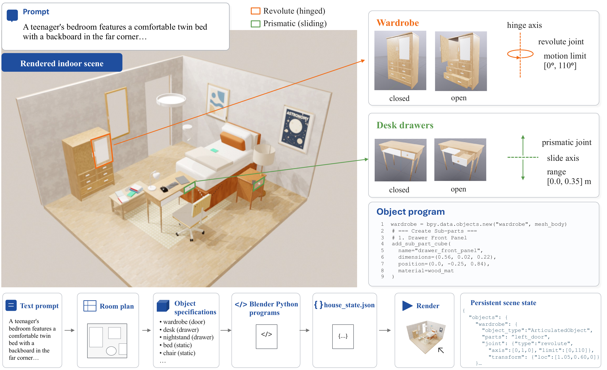

<h1 align="center">SceneCode: Executable World Programs for Editable Indoor Scenes with Articulated Objects</h1>

<p align="center">
  <strong>
    Puyi Wang<sup>*1</sup>,
    Yuhao Wang<sup>*2,3</sup>,
    Linjie Li<sup>4</sup>,
    Zhengyuan Yang<sup>4</sup><br>
    Kevin Qinghong Lin<sup>5</sup>,
    Yangguang Li<sup>1</sup>,
    Yu Cheng<sup>1</sup>
  </strong>
</p>

<p align="center">
  <sup>1</sup>The Chinese University of Hong Kong&nbsp;&nbsp;
  <sup>2</sup>Shanghai Jiao Tong University&nbsp;&nbsp;
  <sup>3</sup>Shanghai AI Laboratory<br>
  <sup>4</sup>Microsoft&nbsp;&nbsp;
  <sup>5</sup>University of Oxford<br>
  <sup>*</sup>Equal contribution.
</p>

<p align="center">
  <a href="https://arxiv.org/abs/2605.19587"><strong>arXiv</strong></a> |
  <a href="https://scene-code.github.io/"><strong>Project Page</strong></a>
</p>

<p align="center">
  
</p>

## 🧩 Overview

SceneCode represents editable indoor scenes with articulated objects as executable world programs. This repository hosts the open-source release of the SceneCode codebase.

## 📝 Abstract

Indoor scene synthesis underpins embodied AI, robotic manipulation, and simulation-based policy evaluation, where a useful scene must specify not only what the environment looks like, but also how its objects are structured.

Existing pipelines, however, typically represent generated content as static meshes and inherit articulation only from curated asset libraries, which limits object-level controllability and prevents new interactable assets from being produced on demand.

We address this gap by formulating physically interactable indoor scene synthesis as programmatic world generation, and present **SceneCode**, a framework that compiles a natural language prompt into an executable, code-driven indoor world rather than a collection of opaque meshes. A room-level agentic backbone first turns the prompt into a structured house layout and emits per-object *AssetRequest*s through a planner-designer-critic loop. Each request is then routed to one of five code-generation strategies and converted into a synthesized part-wise Blender Python program that is validated through an execution-guided repair-and-refine loop. The resulting programs are compiled into simulation-ready assets, and exported as SDF for physics simulation. A persistent scene-state registry links object requests, executable programs, rendered geometry, and simulation assets, turning scene assembly into a traceable and locally editable world-building process.

We evaluate SceneCode across scene-level synthesis, object-level asset quality, human judgment, and downstream robot interaction. Results show that executable world programs improve prompt-faithful indoor scene generation and produce assets with cleaner mesh structure, and simulator-loadable articulation metadata.

## 📰 News
- **[2026/05/29]** Code released.
- **[2026/05/20]** Paper released.

## 📦 Installation

SceneCode relies on three independent components:

1. A **core venv** (`.venv`) that holds the SceneCode pipeline and all of its dependencies declared in [`pyproject.toml`](pyproject.toml).
2. A standalone **Blender 4.4** installation used by the pipeline to compile assets and render scenes. It is invoked as an external executable on `PATH`.
3. An optional **external Flux environment** that is intentionally kept outside the core venv as an alternative image-generation backend (instead of API calls). The core venv reaches Flux through two environment variables, not through Python imports.

### 1. Core venv (`.venv`)

This repository uses [`uv`](https://docs.astral.sh/uv/) for dependency management.

Install `uv`:

```bash
curl -LsSf https://astral.sh/uv/install.sh | sh
```

Install the dependencies into `.venv`:

```bash
uv sync
```

<!-- To install without dev dependencies:

```bash
uv sync --no-dev
``` -->

Activate the virtual env:

```bash
source .venv/bin/activate
```

Optionally install the pre-commit hooks:

```bash
pre-commit install
```

### 2. Blender

SceneCode launches Blender as an external process for asset compilation and rendering, so a standalone Blender 4.4 build must be available on `PATH`. We have tested with `blender-4.4.3-linux-x64`.

Download a portable Linux build from the official [Blender download page](https://www.blender.org/download/) (or the [release archive](https://download.blender.org/release/Blender4.4/)) and extract it somewhere on disk, e.g.:

```bash
wget https://download.blender.org/release/Blender4.4/blender-4.4.3-linux-x64.tar.xz
tar -xf blender-4.4.3-linux-x64.tar.xz -C /path/to/install_dir
```

Then prepend the extracted directory to `PATH` so the `blender` executable is discoverable.

### 3. External Flux repo

The Flux image-generation model is **not** declared in [`pyproject.toml`](pyproject.toml) and is **not** installed into `.venv`. We keep it in its own conda environment. To set up the Flux conda environment and download the checkpoint, follow the [FLUX.2-klein-9B](https://huggingface.co/black-forest-labs/FLUX.2-klein-9B) model card and the [flux2](https://github.com/black-forest-labs/flux2) inference repository.

You can point the core venv at an existing Flux install by setting two environment variables:

- `FLUX_PYTHON` — absolute path to the Python interpreter inside the Flux environment.
- `FLUX_MODEL_PATH` — absolute path to the Flux model checkpoint directory.

SceneCode will spawn `FLUX_PYTHON` as a subprocess whenever a Flux-backed asset request is routed.

## ⚙️ Configuration

All runtime configuration is passed through environment variables. The minimal set you need to export before running `main.py` is shown below:

```bash
# Model / API settings
export OPENAI_API_KEY="your-openai-key"
export OPENAI_API_BASE="https://your-openai-compatible-endpoint/v1"

# Blender runtime settings
export PATH="/path/to/blender-4.4.3-linux-x64:$PATH"
export SCENECODE_BLENDER_GLOBAL_LOCK=$HOME/.cache/scenecode/blender_requests.lock

# (optional) Flux-related paths
export FLUX_PYTHON="/path/to/flux/venv/bin/python"
export FLUX_MODEL_PATH="/path/to/ckpt/FLUX.2-klein-9B"
```

**Model / API settings**

- `OPENAI_API_KEY` — API key used by the agentic backbone (planner / designer / critic).
- `OPENAI_API_BASE` — base URL of the OpenAI-compatible endpoint. Override this when routing through a proxy or a self-hosted gateway.

**Blender runtime settings**

- `PATH` — prepend the Blender 4.4 directory so the pipeline can launch `blender` for asset compilation and rendering.
- `SCENECODE_BLENDER_GLOBAL_LOCK` — file path used as a cross-process lock for Blender requests. Any writable location is fine; the file itself does not need to exist beforehand.

**(optional) Flux paths** — only required if the Flux-backed image generation path is enabled.

- `FLUX_PYTHON` — interpreter inside the Flux environment (see [Installation](#installation)).
- `FLUX_MODEL_PATH` — Flux checkpoint directory.

## 🎬 Scene Generation

### Quick Start

A full single-scene run:

```bash
python main.py +name=my_experiment
```

Set `experiment.prompts` to a list of natural-language prompts and `+name=...` to label the output directory under `outputs/`.

### Pipeline Stage Control

The SceneCode pipeline (configured in [`configs/experiment/base_experiment.yaml`](configs/experiment/base_experiment.yaml)) runs five stages in order:

1. **`floor_plan`** — generate room geometry (walls, floor).
2. **`furniture`** — place furniture in the room.
3. **`wall_mounted`** — place wall-mounted objects (mirrors, artwork, shelves, clocks).
4. **`ceiling_mounted`** — place ceiling fixtures (chandeliers, pendant lights, fans).
5. **`manipuland`** — place small objects on furniture surfaces.

Use `experiment.pipeline.start_stage` and `experiment.pipeline.stop_stage` to control which stages run.

**Stop after a specific stage:**

```bash
python main.py +name=my_experiment experiment.pipeline.stop_stage=furniture
```

**Resume from a later stage of a previous run**:

```bash
python main.py +name=resume_scene_wall_only \
  experiment.pipeline.resume_from_path=outputs/2026-05-27/21-04-00 \
  experiment.pipeline.start_stage=furniture \
  experiment.pipeline.stop_stage=wall_mounted \
  experiment.num_workers=1
```

**Batch runs**

Run a CSV batch in one experiment.

Use `experiment.csv_path` when you want one SceneCode process to load multiple prompts. The CSV must have a header row and two columns:

```bash
python main.py +name=batch_example \
  experiment.csv_path=examples/prompts.csv \
  experiment.num_workers=1
```

**Important final artifacts:**
- scene_{id}/room_{name}/generated_assets/{category}
  - ./code_object/: code-generated objects
  - ./sdf/: simulation-ready objects
- scene_{id}/materials/generated_materials: generated materials
- scene_{id}/combined_house
  - house.blend: renderable blender room
  - house.dmd.yaml: simulation-ready room (load in drake)
  - house_state.json: persistent scene-state registry
  - house_furniture_welded.dmd.yaml: same house with furniture welded to the floor

## 🙏 Acknowledgements

Part of our code is based on [SceneSmith](https://github.com/nepfaff/scenesmith). Thanks for their awesome work!

## 📚 Citation

```bibtex
@misc{wang2026scenecodeexecutableworldprograms,
      title={SceneCode: Executable World Programs for Editable Indoor Scenes with Articulated Objects},
      author={Puyi Wang and Yuhao Wang and Linjie Li and Zhengyuan Yang and Kevin Qinghong Lin and Yangguang Li and Yu Cheng},
      year={2026},
      eprint={2605.19587},
      archivePrefix={arXiv},
      primaryClass={cs.AI},
      url={https://arxiv.org/abs/2605.19587},
}
```